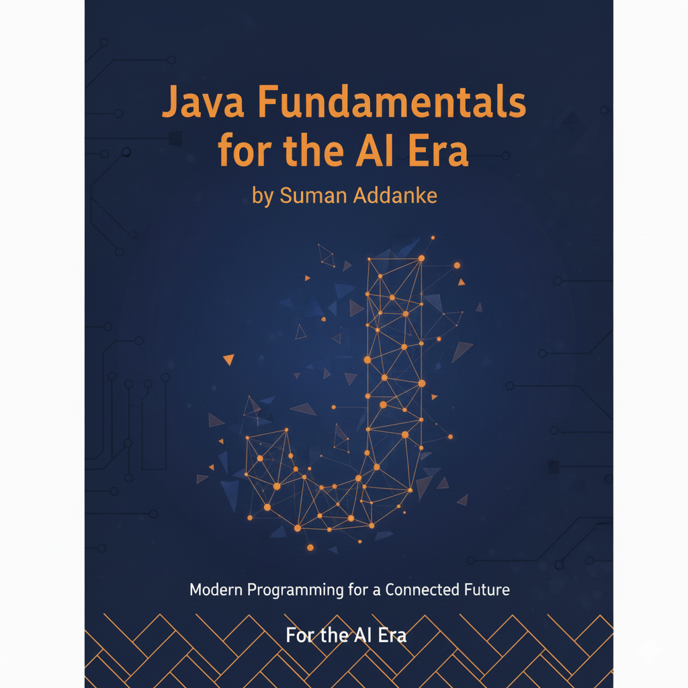

<div style="text-align: center; page-break-after: always;">

<br><br><br><br><br><br><br><br>

# JAVA FUNDAMENTALS FOR THE AI ERA

<br>

## A GenZ Guide to Understanding Before Automating

<br><br><br>

<!--
COVER IMAGE PLACEHOLDER

USE THIS PROMPT WITH MIDJOURNEY, DALL-E, OR STABLE DIFFUSION:

"Create a modern, clean book cover for a programming book titled 'Java Fundamentals for the AI Era'.

Style: Minimalist, tech-forward, appealing to GenZ developers
Color scheme: Deep blue (#1a237e) with electric orange (#ff6d00) accents
Elements to include:
- Abstract representation of Java code or coffee cup icon
- AI neural network pattern subtly integrated
- Modern geometric shapes
- Clean sans-serif typography space for title

Mood: Professional yet approachable, cutting-edge but accessible
Avoid: Cheesy robot imagery, cluttered designs, outdated tech aesthetics

The design should convey: 'This is a modern programming book that bridges traditional learning with AI-era development'"

After generating, save as cover-image.png in the same folder as this file.
-->



<br><br><br><br>

### By Suman Addanke

<br>

**First Edition | DEC 2025**

<br><br><br>

*"You can't effectively use AI to write code you don't understand."*

</div>

---

<div style="page-break-after: always;"></div>

# About This Book

## Who This Book Is For

This book is written for GenZ developers (ages 18-28) who:

- Use AI coding tools like GitHub Copilot, ChatGPT, or Claude
- Want to move beyond "vibe coding" to true understanding
- Are starting their programming journey or filling foundational gaps
- Aspire to become developers who leverage AI effectively, not depend on it blindly

## The Core Philosophy

In an age where AI can generate code in seconds, why learn to code at all?

Because **AI is a multiplier, not a replacement.** It amplifies what you already know:
- Strong understanding + AI = **Superpower**
- Weak understanding + AI = **Dangerous**
- No understanding + AI = **Useless**

This book takes a different approach:

1. **Learn the concept first** - Understand deeply before using shortcuts
2. **Practice hands-on** - Type every example, complete every exercise
3. **Then leverage AI** - Use AI as an informed developer who can evaluate its output

## How to Use This Book

### Reading
- Read chapters in order - each builds on the previous
- Don't skip the "Why" sections - understanding matters more than syntax

### Coding
- Type all code examples yourself (no copy-paste!)
- Complete exercises before checking solutions
- Build the hands-on projects from scratch

### AI Integration
- Resist using AI until Part 4 (Chapters 15-17)
- When you do use AI, evaluate everything it produces
- Compare AI output to your own solutions

## Companion Resources

- **GitHub Repository:** [link to your repo]
- **YouTube Channel:** [link to your channel]
- **Practice Exercises:** Available in the code-examples folder

---

<div style="page-break-after: always;"></div>

# About the Author

## [Your Name]

[Write 2-3 paragraphs about yourself here]

**Professional Background:**
- Your experience with Java/software development
- Your experience with AI tools
- Why you wrote this book

**Connect with Me:**
- Website: [your website]
- LinkedIn: [your profile]
- Twitter/X: [your handle]
- YouTube: [your channel]
- Email: [your email]

---

<div style="page-break-after: always;"></div>

# Preface

## Why I Wrote This Book

The AI coding revolution is here. Tools like GitHub Copilot, ChatGPT, and Claude can generate working code in seconds. I've watched developers embrace these tools with enthusiasm - and I've watched them struggle when things go wrong.

I've seen talented people:
- Accept buggy code because it "looked right"
- Spend hours debugging AI-generated code they didn't understand
- Build applications with security vulnerabilities they couldn't recognize
- Become dependent on AI without developing fundamental skills

This isn't the AI's fault. These tools are remarkable. The problem is how we use them.

**The developers who thrive with AI are those who could code without it.**

They understand what they're building. They can evaluate suggestions. They know when AI gets it wrong. They use AI as a multiplier, not a crutch.

This book exists to help you become that kind of developer.

## The Promise

By the end of this book, you will:

- Understand Java fundamentals deeply - not just syntax, but concepts
- Be able to read and evaluate any Java code, AI-generated or otherwise
- Know how to prompt AI effectively for Java development
- Have the skills to debug when AI suggestions fail
- Be confident in when to use AI and when to code yourself

## A Note to Readers

Learning to code takes time. There are no shortcuts to true understanding.

But here's the good news: once you understand fundamentals, AI becomes incredibly powerful. You'll work faster than developers who rely on AI blindly, because you'll work *reliably*.

Take your time with this book. Type every example. Complete every exercise. The investment will pay dividends throughout your career.

Let's begin.

---

<div style="page-break-after: always;"></div>

# Table of Contents

## Front Matter

| Section | Page |
|---------|------|
| About This Book | |
| About the Author | |
| Preface | |

---

## Part 1: Foundation - Why Understanding Matters

| Chapter | Title | Page |
|---------|-------|------|
| 1 | The AI Paradox - Why Learning Still Matters | |
| 2 | Setting Up Your Java Environment | |

---

## Part 2: Core Java Concepts

| Chapter | Title | Page |
|---------|-------|------|
| 3 | Variables, Data Types & Operators | |
| 4 | Control Flow - Making Decisions and Repeating Actions | |
| 5 | Object-Oriented Programming - Classes and Objects | |
| 6 | The Four Pillars of OOP | |
| 7 | Exception Handling | |
| 8 | Collections Framework | |
| 9 | Generics | |
| 10 | Streams & Lambda Expressions | |
| 11 | Concurrency Basics | |

---

## Part 3: Modern Java Development

| Chapter | Title | Page |
|---------|-------|------|
| 12 | Java Modules & Project Structure | |
| 13 | Working with Files and I/O | |
| 14 | Unit Testing with JUnit | |

---

## Part 4: AI Integration - Now You're Ready

| Chapter | Title | Page |
|---------|-------|------|
| 15 | Effective AI Prompting for Java | |
| 16 | Code Review Skills for AI Output | |
| 17 | Building with AI as Your Pair Programmer (Final Project) | |

---

## Back Matter

| Section | Page |
|---------|------|
| Appendix A: Java Keywords Reference | |
| Appendix B: Common Design Patterns | |
| Appendix C: Interview Questions You Should Know | |
| Appendix D: Resources for Continued Learning | |
| Acknowledgments | |
| About the Companion YouTube Series | |
| Index | |

---

<div style="page-break-after: always;"></div>

# PART 1: FOUNDATION

## Why Understanding Matters

*Before we write a single line of Java, we need to understand why learning still matters in the age of AI.*

---

<div style="page-break-after: always;"></div>

# Chapter 1: The AI Paradox - Why Learning Still Matters

> "The best way to predict the future is to understand the past."

---

## What You'll Learn

- Why AI coding tools can be both powerful and dangerous
- The "vibe coding" trap and how to avoid it
- Real examples of AI-generated bugs that understanding would prevent
- How foundational knowledge makes you 10x more effective with AI

---

## The Scene

It's 11 PM. You're building a side project - a todo app that syncs across devices. You've been using an AI coding assistant, and it's been amazing. In just two hours, you've got a working prototype. The AI wrote your database schema, API endpoints, and React components.

You deploy it. Share the link with friends. Go to sleep feeling accomplished.

At 3 AM, your phone buzzes. Your friend messages: "Bro, I can see everyone's todos. Not just mine. Everyone's."

Your heart sinks. You check the app. They're right. There's no user authentication on the API. The AI wrote endpoints that return ALL todos, not just the current user's. You accepted the code because it looked right. It ran without errors. You didn't understand it well enough to see the security hole.

**This is the AI paradox.**

---

## The Vibe Coding Trap

There's a term floating around developer communities: **"vibe coding."**

Vibe coding means using AI to generate code based on vibes - a general sense that the output looks right - without truly understanding what the code does. The code compiles. The tests pass (if there are any). The feature works... mostly.

Here's what vibe coding looks like:

```
You: "Create a function to validate user passwords"

AI: "Here's a password validation function..."
[50 lines of code]

You: "Looks good" *copies into project*
```

But did you check:
- What counts as a "valid" password?
- Is it checking for common passwords?
- Is it vulnerable to timing attacks?
- Does it match your app's actual requirements?

**Vibe coding is accepting code because it seems correct, not because you know it's correct.**

---

## The Real Cost of Not Understanding

Let me share some real scenarios (names changed, situations real):

### Scenario 1: The Infinite Loop

A developer asked AI to write a function that processes a list until a condition is met. The AI generated:

```java
while (items.size() > 0) {
    Item item = items.get(0);
    if (item.isProcessed()) {
        continue;
    }
    processItem(item);
}
```

Can you spot the bug?

The `continue` statement jumps to the next iteration, but nothing removes items from the list. If any item is already processed, this becomes an infinite loop. In production, this consumed 100% CPU and crashed the server.

**With understanding:** You'd recognize that the loop needs to either remove items or use an iterator. You'd see `continue` without removal is dangerous.

### Scenario 2: The SQL Injection

AI generated this code for a search feature:

```java
String query = "SELECT * FROM users WHERE name LIKE '%" + searchTerm + "%'";
```

Classic SQL injection vulnerability. An attacker could input `'; DROP TABLE users; --` and delete all user data.

The developer didn't know about SQL injection. The AI didn't warn about it. The code worked perfectly... until it didn't.

**With understanding:** You'd know to use parameterized queries. You'd see raw string concatenation in SQL as a red flag.

### Scenario 3: The Memory Leak

For a file processing feature, AI suggested:

```java
public void processFiles(List<String> filePaths) {
    for (String path : filePaths) {
        FileInputStream fis = new FileInputStream(path);
        // process the file
        byte[] data = fis.readAllBytes();
        process(data);
    }
}
```

Spot the issue?

The `FileInputStream` is never closed. Process enough files, and you'll run out of file handles. The application becomes unable to open any new files.

**With understanding:** You'd know about resource management in Java, try-with-resources, and the importance of closing streams.

---

## The Debugging Disaster

Here's an uncomfortable truth: **AI can write code faster than you can debug it.**

When AI-generated code breaks (and it will), you're left staring at code you didn't write and don't understand. You can ask AI to fix it, but:

1. AI might not know what's wrong
2. AI might introduce new bugs while "fixing"
3. AI doesn't know your full system context
4. You become trapped in a cycle of "AI wrote it, AI broke it, AI... can't fix it?"

I've seen developers spend 8 hours debugging code that AI generated in 8 seconds. The irony is painful.

**Understanding your code isn't slower - it's faster in the long run.**

---

## The 10x Developer Myth

You've heard of the "10x developer" - someone supposedly 10 times more productive than average. Some people think AI makes everyone a 10x developer.

Here's the reality:

| Developer Type | Without AI | With AI |
|----------------|-----------|---------|
| Doesn't understand fundamentals | 1x | 2x (but buggy) |
| Understands fundamentals | 1x | 10x (and reliable) |

AI is a **multiplier**, not a replacement. It multiplies what you already know.

- **0 understanding × AI = 0 useful output** (you can't evaluate it)
- **Some understanding × AI = Dangerous** (you might miss issues)
- **Strong understanding × AI = Superpower** (you know what to accept, reject, modify)

The goal isn't to avoid AI. It's to become the kind of developer who can wield AI effectively.

---

## What Understanding Actually Means

Understanding code doesn't mean memorizing syntax. It means:

### 1. Knowing What Should Happen
When you read code, you can predict its behavior without running it.

### 2. Recognizing What Could Go Wrong
You see edge cases, error conditions, and potential failures.

### 3. Evaluating Trade-offs
You understand why one approach might be better than another for your specific situation.

### 4. Debugging Effectively
When something breaks, you have mental models for where to look.

### 5. Communicating Precisely
You can describe what you need from AI in terms it can act on correctly.

---

## The Informed Developer Approach

This book follows a specific pattern:

```
Learn Concept → Practice Hands-On → Understand Deeply → Then (and only then) Use AI
```

For each topic, we'll:

1. **Explain the concept** - What it is and why it matters
2. **Build something together** - Without AI, typing every line
3. **Explore edge cases** - What can go wrong and why
4. **Then introduce AI** - Show how to use AI for that concept
5. **Compare and evaluate** - Your code vs AI code, understanding differences

By the end, you won't just know Java. You'll know:
- How to prompt AI effectively for Java tasks
- How to review AI-generated Java code
- How to debug when AI gets it wrong
- When to use AI and when to code yourself

---

## A Different Kind of Promise

Most programming books promise you'll build apps quickly. This one makes a different promise:

**After reading this book, you will never again blindly accept code you don't understand.**

That might sound less exciting than "build a startup in a weekend!" But it's more valuable. Because:

- You'll ship fewer bugs
- You'll debug faster
- You'll learn faster (understanding compounds)
- You'll make AI actually useful instead of actually dangerous

---

## What's Coming

Here's our journey:

**Part 1 (Chapters 1-2):** Foundation
- Why understanding matters (you're here!)
- Setting up your environment properly

**Part 2 (Chapters 3-11):** Core Java
- Variables and types
- Control flow
- Object-oriented programming
- Collections and generics
- Modern Java features
- Concurrency basics

**Part 3 (Chapters 12-14):** Professional Development
- Project structure
- File handling
- Unit testing

**Part 4 (Chapters 15-17):** AI Integration
- Effective prompting
- Code review skills
- Final project bringing it all together

Each chapter builds on the last. Skip nothing.

---

## Your Commitment

Before moving on, I want you to make a commitment:

**"I will type every code example myself. I will complete every exercise. I will not use AI to write code until Part 4."**

This isn't about suffering. It's about building muscle memory, intuition, and understanding that AI assistance can then amplify.

The developers who struggle most with AI are those who started with AI. The developers who excel with AI are those who could code without it.

Be the second type.

---

## Key Takeaways

- **AI is a multiplier:** It amplifies your existing knowledge, for better or worse
- **Vibe coding is dangerous:** Accepting code without understanding creates hidden problems
- **Debugging requires understanding:** AI-generated bugs need human debugging skills
- **This book's approach:** Learn deeply first, then leverage AI effectively
- **Your commitment:** Type everything, complete everything, no AI until Part 4

---

## Exercise: Self-Assessment

Before continuing, honestly answer these questions:

1. When AI generates code for you, what percentage do you truly understand?
   - [ ] Less than 25%
   - [ ] 25-50%
   - [ ] 50-75%
   - [ ] More than 75%

2. When AI-generated code has a bug, can you usually find and fix it yourself?
   - [ ] Rarely
   - [ ] Sometimes
   - [ ] Usually
   - [ ] Always

3. Can you explain what happens at each line of your most recent project?
   - [ ] No
   - [ ] Partially
   - [ ] Mostly
   - [ ] Yes, completely

Your answers will be different by the end of this book.

---

## Up Next

**Chapter 2: Setting Up Your Java Environment**

We'll get your development environment ready - the proper way. No AI shortcuts. Full understanding of what each piece does and why.

Let's begin.

---

*"Give a person AI-generated code, they'll ship today. Teach a person to understand code, they'll ship reliably forever."*

---

<div style="page-break-after: always;"></div>

# Chapter 2: Setting Up Your Java Environment

> "A craftsman is only as good as their tools - and their understanding of those tools."

---

## What You'll Learn

- The difference between JDK, JRE, and JVM
- How to install Java on Windows, Mac, and Linux
- Setting up environment variables correctly
- Choosing and configuring your IDE
- Writing and running your first Java program
- Understanding the compilation process

---

## Why Setup Matters

You might be thinking: "Can't I just use an online compiler?"

Sure, you could. But here's why we're doing this properly:

1. **Professional development happens locally** - Real jobs require local setups
2. **Understanding the toolchain** - Knowing what happens behind "Run" button
3. **Debugging capability** - Online compilers hide important information
4. **No AI shortcuts** - Setup is where many developers first reach for AI help

This chapter might feel slow. That's intentional. We're building understanding, not just a working setup.

---

## The Java Ecosystem: JVM, JRE, and JDK

Before installing anything, let's understand what we're installing.

### The Java Virtual Machine (JVM)

The JVM is Java's secret sauce. It's why Java code can run on any operating system.

**The Traditional Way (C/C++):**
```
Source Code → Compile → Machine Code (specific to Windows/Mac/Linux)
```
You need different compiled versions for each operating system.

**The Java Way:**
```
Source Code → Compile → Bytecode → JVM → Machine Code
```

Java compiles to "bytecode" - an intermediate format. The JVM then translates bytecode to machine code for whatever system it's running on.

**Analogy:** Think of bytecode as a universal recipe. The JVM is a chef who can cook that recipe in any kitchen (operating system), adapting to whatever equipment is available.

### The Java Runtime Environment (JRE)

The JRE = JVM + Standard Libraries

It's everything needed to **run** Java programs:
- The JVM itself
- Core libraries (collections, I/O, networking, etc.)
- Supporting files

If someone just wants to run Java applications (not develop them), they only need the JRE.

### The Java Development Kit (JDK)

The JDK = JRE + Development Tools

It's everything needed to **develop** Java programs:
- Everything in JRE
- Compiler (`javac`)
- Debugger
- Documentation generator
- Other development tools

**As developers, we need the JDK.**

### Visual Summary

```
┌─────────────────────────────────────────────┐
│                    JDK                       │
│  ┌───────────────────────────────────────┐  │
│  │                JRE                     │  │
│  │  ┌─────────────────────────────────┐  │  │
│  │  │              JVM                 │  │  │
│  │  │   (Runs bytecode on any OS)     │  │  │
│  │  └─────────────────────────────────┘  │  │
│  │  + Standard Libraries                 │  │
│  └───────────────────────────────────────┘  │
│  + Compiler (javac)                          │
│  + Debugger, Documentation tools             │
└─────────────────────────────────────────────┘
```

---

## Choosing a JDK: OpenJDK vs Oracle JDK

You'll encounter different JDK distributions. Here's what you need to know:

### OpenJDK
- **Open source** - Free to use anywhere
- **Community maintained** - With Oracle's involvement
- **The reference implementation** - What "Java" officially is
- **Recommended for learning and most development**

### Oracle JDK
- **Commercial** - Free for development, licensing for production
- **Oracle maintained** - With additional tooling
- **Identical codebase** - Same code as OpenJDK (since Java 11)

### Other Distributions
- **Amazon Corretto** - Amazon's OpenJDK build
- **Adoptium (Eclipse Temurin)** - Community builds
- **Azul Zulu** - Another popular distribution

**For this book: Use OpenJDK or Adoptium.** They're free, reliable, and what most companies use.

---

## Java Versions: Which One?

Java has a 6-month release cycle. As of this writing:

| Version | Type | Recommendation |
|---------|------|----------------|
| Java 8 | LTS | Legacy, avoid for new projects |
| Java 11 | LTS | Minimum for modern development |
| Java 17 | LTS | **Recommended for this book** |
| Java 21 | LTS | Latest LTS, also excellent choice |

**LTS = Long Term Support** - These versions get security updates for years.

**We'll use Java 17 or 21** - Modern features, long-term support, widely used.

---

## Installation: Windows

### Step 1: Download the JDK

1. Go to https://adoptium.net/
2. Select your operating system (Windows)
3. Choose version (17 or 21 LTS)
4. Download the `.msi` installer

### Step 2: Run the Installer

1. Double-click the downloaded `.msi` file
2. Follow the installation wizard
3. **Important:** Check "Set JAVA_HOME variable" if offered
4. Note the installation path (usually `C:\Program Files\Eclipse Adoptium\jdk-17...`)

### Step 3: Set Environment Variables (if not automatic)

1. Open Start Menu, search "Environment Variables"
2. Click "Edit the system environment variables"
3. Click "Environment Variables" button
4. Under "System variables":

**Create JAVA_HOME:**
- Click "New"
- Variable name: `JAVA_HOME`
- Variable value: `C:\Program Files\Eclipse Adoptium\jdk-17.0.x` (your actual path)

**Update PATH:**
- Find "Path" in system variables, click "Edit"
- Click "New"
- Add: `%JAVA_HOME%\bin`

### Step 4: Verify Installation

Open Command Prompt (cmd) and run:

```cmd
java -version
```

You should see:
```
openjdk version "17.0.x" 2023-xx-xx
OpenJDK Runtime Environment Temurin-17.0.x+x (build 17.0.x+x)
OpenJDK 64-Bit Server VM Temurin-17.0.x+x (build 17.0.x+x, mixed mode, sharing)
```

Also verify the compiler:
```cmd
javac -version
```

Output: `javac 17.0.x`

**If you see "not recognized as a command":** Your PATH isn't set correctly. Go back to Step 3.

---

## Installation: macOS

### Option 1: Using Homebrew (Recommended)

If you don't have Homebrew, install it first:
```bash
/bin/bash -c "$(curl -fsSL https://raw.githubusercontent.com/Homebrew/install/HEAD/install.sh)"
```

Then install Java:
```bash
brew install openjdk@17
```

Create a symlink so the system finds it:
```bash
sudo ln -sfn $(brew --prefix)/opt/openjdk@17/libexec/openjdk.jdk /Library/Java/JavaVirtualMachines/openjdk-17.jdk
```

### Option 2: Manual Installation

1. Go to https://adoptium.net/
2. Download the `.pkg` installer for macOS
3. Run the installer
4. Follow the prompts

### Set JAVA_HOME

Add to your `~/.zshrc` (or `~/.bash_profile` for older Macs):

```bash
export JAVA_HOME=$(/usr/libexec/java_home -v 17)
export PATH=$JAVA_HOME/bin:$PATH
```

Reload your shell:
```bash
source ~/.zshrc
```

### Verify Installation

```bash
java -version
javac -version
```

---

## Installation: Linux (Ubuntu/Debian)

### Using APT

```bash
# Update package list
sudo apt update

# Install OpenJDK 17
sudo apt install openjdk-17-jdk

# Verify
java -version
javac -version
```

### Set JAVA_HOME

Find where Java is installed:
```bash
sudo update-alternatives --config java
```

Note the path (like `/usr/lib/jvm/java-17-openjdk-amd64`)

Add to `~/.bashrc`:
```bash
export JAVA_HOME=/usr/lib/jvm/java-17-openjdk-amd64
export PATH=$JAVA_HOME/bin:$PATH
```

Reload:
```bash
source ~/.bashrc
```

---

## Understanding JAVA_HOME

Why do we set `JAVA_HOME`?

1. **Build tools need it** - Maven, Gradle look for JAVA_HOME
2. **IDEs use it** - To find the correct JDK
3. **Scripts reference it** - Standard way to locate Java
4. **Multiple Java versions** - Easily switch by changing JAVA_HOME

**Test it's set correctly:**

Windows:
```cmd
echo %JAVA_HOME%
```

Mac/Linux:
```bash
echo $JAVA_HOME
```

Should print your JDK installation path.

---

## Your First Java Program: The Traditional Way

Before using any IDE, let's understand what happens underneath.

### Step 1: Create the Source File

Open any text editor (Notepad, TextEdit, nano - not Word!).

Type exactly this:

```java
public class HelloWorld {
    public static void main(String[] args) {
        System.out.println("Hello, World!");
    }
}
```

**Important rules:**
- File name MUST match class name: `HelloWorld.java`
- Java is case-sensitive: `HelloWorld` ≠ `helloworld`
- Save with `.java` extension

Save the file as `HelloWorld.java` in a folder you can easily find (e.g., `C:\java-practice` or `~/java-practice`).

### Step 2: Compile

Open terminal/command prompt. Navigate to your folder:

```bash
cd ~/java-practice    # Mac/Linux
cd C:\java-practice   # Windows
```

Compile:
```bash
javac HelloWorld.java
```

If successful, you'll see... nothing! No output means no errors.

But look in your folder - there's a new file: `HelloWorld.class`

This `.class` file contains **bytecode** - the compiled version of your program.

### Step 3: Run

```bash
java HelloWorld
```

Note: No `.class` extension when running!

Output:
```
Hello, World!
```

### What Just Happened?

```
HelloWorld.java  →  javac  →  HelloWorld.class  →  java  →  "Hello, World!"
   (source)       (compile)     (bytecode)        (run)      (output)
```

1. `javac` (Java Compiler) read your source code
2. Checked for syntax errors
3. Generated bytecode in `.class` file
4. `java` command started the JVM
5. JVM loaded and executed the bytecode
6. Output appeared on screen

**This is what IDEs do automatically** - but now you understand what's happening.

---

## Anatomy of Hello World

Let's break down every part:

```java
public class HelloWorld {
    public static void main(String[] args) {
        System.out.println("Hello, World!");
    }
}
```

### `public class HelloWorld`
- `public` - Accessible from anywhere
- `class` - Everything in Java lives in a class
- `HelloWorld` - The name (must match filename)

### `public static void main(String[] args)`
This is the **entry point** - where your program starts.

- `public` - JVM needs to access this from outside
- `static` - Can be called without creating an object
- `void` - Returns nothing
- `main` - Special name the JVM looks for
- `String[] args` - Command-line arguments (we'll use later)

### `System.out.println("Hello, World!");`
- `System` - A built-in class
- `out` - The standard output stream
- `println` - Print line (adds newline at end)
- `"Hello, World!"` - A String (text in double quotes)
- `;` - Statements end with semicolon

---

## Choosing an IDE

Now that you understand what happens behind the scenes, let's set up a proper development environment.

### IntelliJ IDEA (Recommended)

**Why IntelliJ:**
- Most popular Java IDE
- Excellent code completion
- Great debugging tools
- Free Community Edition is sufficient

**Installation:**
1. Go to https://www.jetbrains.com/idea/download/
2. Download **Community Edition** (free)
3. Run installer, follow prompts
4. On first launch, select "Do not import settings"

**First Project:**
1. Click "New Project"
2. Select "Java" on the left
3. Ensure JDK is detected (should show your Java 17/21)
4. Click Next, Next
5. Name: `java-practice`, click Finish
6. Right-click `src` → New → Java Class → `HelloWorld`
7. Type the code, right-click → Run

### VS Code Alternative

If you prefer VS Code:

1. Install VS Code
2. Install "Extension Pack for Java" extension
3. Create a folder, open in VS Code
4. Create `HelloWorld.java`
5. Click "Run" above the main method

VS Code is lighter but IntelliJ has better Java-specific features.

---

## IDE vs Command Line: Know Both

Many developers only know IDE buttons. When something breaks, they're lost.

**Always understand the command line:**
- IDEs are running `javac` and `java` for you
- Build servers don't have IDEs
- Debugging often requires command-line knowledge
- Job interviews may test this

**Practice both:** Use IDE for productivity, but periodically compile from command line to stay sharp.

---

## Troubleshooting Common Issues

### "java is not recognized as a command"
- JAVA_HOME not set, or not in PATH
- Solution: Revisit environment variable setup

### "javac is not recognized"
- You might have JRE instead of JDK
- Solution: Install JDK, not just JRE

### "Could not find or load main class"
- Wrong directory
- Class name doesn't match filename
- Solution: Check you're in the right folder, names match exactly

### "Class names only accepted if annotation processing is explicitly requested"
- You included `.java` when running: `java HelloWorld.java`
- Solution: Run without extension: `java HelloWorld`

### IDE doesn't find JDK
- JAVA_HOME not set
- Solution: In IDE settings, manually point to JDK location

---

## Exercises

### Exercise 2.1: Verify Your Setup
Run these commands and confirm the output:
```bash
java -version
javac -version
echo $JAVA_HOME   # or %JAVA_HOME% on Windows
```

### Exercise 2.2: Command Line Compilation
Without using an IDE:
1. Create `Greeting.java` with a class that prints your name
2. Compile with `javac`
3. Run with `java`
4. Verify the `.class` file exists

### Exercise 2.3: Intentional Errors
Create a file with each of these errors (one at a time). Try to compile and observe the error messages:

1. Missing semicolon
2. Class name doesn't match filename
3. Missing closing brace
4. `Main` instead of `main`
5. `string` instead of `String`

Understanding error messages is a crucial skill!

### Exercise 2.4: Command Line Arguments
Modify HelloWorld to use command-line arguments:

```java
public class Greeter {
    public static void main(String[] args) {
        if (args.length > 0) {
            System.out.println("Hello, " + args[0] + "!");
        } else {
            System.out.println("Hello, stranger!");
        }
    }
}
```

Compile and run:
```bash
javac Greeter.java
java Greeter Alice
java Greeter
```

---

## Key Takeaways

- **JDK = JRE + Development Tools** - We need JDK for development
- **JVM enables portability** - Write once, run anywhere
- **JAVA_HOME is important** - Build tools and IDEs rely on it
- **Compilation creates bytecode** - `.java` → `javac` → `.class` → `java`
- **Know command line AND IDE** - Both skills are essential
- **Error messages are your friends** - Learn to read them

---

## What's Next

Your environment is ready. You understand what happens when you click "Run."

In **Chapter 3**, we'll dive into the building blocks of Java: variables, data types, and operators. You'll learn why Java's type system is actually a superpower, not a limitation.

No more setup. Time to code.

---

*"The person who knows HOW will always have a job. The person who knows WHY will always be their boss."*

---

<div style="page-break-after: always;"></div>

# PART 2: CORE JAVA CONCEPTS

## The Building Blocks

*Now we build your Java foundation, one concept at a time.*

---

<div style="page-break-after: always;"></div>

# Chapter 3: Variables, Data Types & Operators

> "In programming, as in life, knowing what type of thing you're dealing with determines what you can do with it."

---

## What You'll Learn

- What variables are and how to declare them
- Java's eight primitive types and when to use each
- The difference between primitives and reference types
- Type casting: implicit and explicit
- Operators for math, comparison, and logic
- Common pitfalls that AI won't warn you about

---

## What Is a Variable?

A variable is a named container that holds a value.

**Analogy:** Think of a variable as a labeled box.
- The label is the variable name
- The box size/type is the data type
- The contents is the value

```java
int age = 25;
```

Here:
- `int` is the type (size of box)
- `age` is the name (label)
- `25` is the value (contents)

### Why Types Matter

Java is **statically typed** - you must declare what type of data a variable holds, and it can only hold that type.

```java
int age = 25;        // OK
age = "twenty-five"; // ERROR! Can't put String in int box
```

Some languages (like Python, JavaScript) are **dynamically typed** - variables can hold any type. Java's approach catches errors at compile time, before your code runs.

**This is why AI-generated Java code sometimes fails to compile** - it might mix types incorrectly.

---

## The Eight Primitive Types

Java has exactly eight primitive (built-in) types. Memorize them.

### Integer Types (Whole Numbers)

| Type | Size | Range | Use Case |
|------|------|-------|----------|
| `byte` | 8 bits | -128 to 127 | File data, small numbers |
| `short` | 16 bits | -32,768 to 32,767 | Rarely used |
| `int` | 32 bits | ±2.1 billion | **Default choice for integers** |
| `long` | 64 bits | ±9.2 quintillion | Large numbers, timestamps |

```java
byte smallNumber = 100;
short mediumNumber = 30000;
int normalNumber = 2000000000;
long bigNumber = 9000000000000000000L;  // Note the 'L' suffix!
```

**The `L` suffix:** Long literals need `L` at the end, otherwise Java treats them as `int`.

```java
long wrong = 9000000000000000000;   // ERROR! Too big for int
long right = 9000000000000000000L;  // OK with L suffix
```

### Floating-Point Types (Decimals)

| Type | Size | Precision | Use Case |
|------|------|-----------|----------|
| `float` | 32 bits | ~7 digits | Graphics, games (where precision < performance) |
| `double` | 64 bits | ~15 digits | **Default choice for decimals** |

```java
float price = 19.99f;      // Note the 'f' suffix!
double precise = 19.99;    // No suffix needed (default)
```

**The `f` suffix:** Float literals need `f`, otherwise Java treats them as `double`.

### Character Type

| Type | Size | Range | Use Case |
|------|------|-------|----------|
| `char` | 16 bits | Unicode characters | Single characters |

```java
char letter = 'A';
char unicode = '\u0041';  // Also 'A' in Unicode
char newline = '\n';      // Escape sequence
```

**Single quotes for char, double quotes for String:**
```java
char c = 'A';      // Single character
String s = "A";    // String (even with one character)
```

### Boolean Type

| Type | Size | Values | Use Case |
|------|------|--------|----------|
| `boolean` | 1 bit* | `true` or `false` | Conditions, flags |

```java
boolean isActive = true;
boolean hasPermission = false;
```

*Actual memory usage varies by JVM implementation.

---

## Primitive Types: Memory Visualization

```
byte:    [████████]                                    (8 bits)
short:   [████████████████]                            (16 bits)
int:     [████████████████████████████████]            (32 bits)
long:    [████████████████████████████████████████...] (64 bits)

float:   [████████████████████████████████]            (32 bits)
double:  [████████████████████████████████████████...] (64 bits)

char:    [████████████████]                            (16 bits)
boolean: [█]                                           (1 bit)
```

---

## Declaring and Initializing Variables

### Declaration (Creating the Box)

```java
int count;        // Declaration only
```

### Initialization (Putting Something In)

```java
count = 10;       // Initialization
```

### Combined (Most Common)

```java
int count = 10;   // Declaration + initialization
```

### Multiple Variables

```java
int x, y, z;              // Declare three ints
int a = 1, b = 2, c = 3;  // Declare and initialize three ints
```

### Constants (Final Variables)

```java
final double PI = 3.14159;
final int MAX_USERS = 100;

PI = 3.14;  // ERROR! Cannot reassign final variable
```

**Convention:** Constants use `UPPER_SNAKE_CASE`.

---

## Reference Types vs Primitives

Everything that isn't a primitive is a **reference type**.

### Primitives Hold Values Directly

```java
int a = 5;
int b = a;    // b gets a COPY of 5
a = 10;
// a is 10, b is still 5
```

### References Hold Memory Addresses

```java
String s1 = "Hello";
String s2 = s1;    // s2 points to SAME object as s1
```

**Visualization:**

```
Primitives:
┌─────┐     ┌─────┐
│  5  │     │  5  │
└──┬──┘     └──┬──┘
   a           b      (separate copies)

References:
┌─────┐     ┌─────────┐
│ ref │────►│ "Hello" │
└──┬──┘     └─────────┘
   s1             ▲
                  │
┌─────┐           │
│ ref │───────────┘
└──┬──┘
   s2      (both point to same object)
```

### The String Exception

Strings are reference types but behave specially:

```java
String a = "Hello";
String b = "Hello";
// a and b might point to the same object (string pooling)

String c = new String("Hello");
// c is definitely a different object
```

We'll explore this more in later chapters.

---

## Type Casting

Sometimes you need to convert between types.

### Implicit Casting (Widening)

Smaller to larger type happens automatically:

```java
int myInt = 100;
long myLong = myInt;      // int → long (automatic)
double myDouble = myLong;  // long → double (automatic)
```

**Safe direction:** `byte → short → int → long → float → double`

### Explicit Casting (Narrowing)

Larger to smaller type requires explicit cast:

```java
double myDouble = 9.78;
int myInt = (int) myDouble;  // myInt is 9 (decimal truncated!)

long bigValue = 1000L;
byte smallValue = (byte) bigValue;  // Dangerous! May overflow
```

**Warning:** Explicit casting can lose data!

```java
int big = 130;
byte small = (byte) big;  // small is -126 (overflow!)
```

### Common Casting Mistakes

```java
// Dividing integers
int a = 5;
int b = 2;
double result = a / b;     // result is 2.0, not 2.5!

// Fix:
double result = (double) a / b;  // Now result is 2.5
```

**This is a common AI mistake** - generating integer division when you need decimal results.

---

## Operators

### Arithmetic Operators

| Operator | Meaning | Example |
|----------|---------|---------|
| `+` | Addition | `5 + 3` → `8` |
| `-` | Subtraction | `5 - 3` → `2` |
| `*` | Multiplication | `5 * 3` → `15` |
| `/` | Division | `5 / 3` → `1` (integer!) |
| `%` | Modulus (remainder) | `5 % 3` → `2` |

**Integer division truncates:**
```java
System.out.println(7 / 2);    // 3 (not 3.5!)
System.out.println(7.0 / 2);  // 3.5
System.out.println(7 / 2.0);  // 3.5
```

### Assignment Operators

| Operator | Equivalent |
|----------|------------|
| `+=` | `x = x + y` |
| `-=` | `x = x - y` |
| `*=` | `x = x * y` |
| `/=` | `x = x / y` |
| `%=` | `x = x % y` |

```java
int x = 10;
x += 5;   // x is now 15
x *= 2;   // x is now 30
```

### Increment/Decrement

| Operator | Meaning |
|----------|---------|
| `++x` | Pre-increment (increment, then use) |
| `x++` | Post-increment (use, then increment) |
| `--x` | Pre-decrement |
| `x--` | Post-decrement |

```java
int a = 5;
System.out.println(a++);  // Prints 5, then a becomes 6
System.out.println(++a);  // a becomes 7, then prints 7
```

**This is confusing!** When in doubt, use separate statements:
```java
a = a + 1;  // Clear and explicit
```

### Comparison Operators

| Operator | Meaning |
|----------|---------|
| `==` | Equal to |
| `!=` | Not equal to |
| `>` | Greater than |
| `<` | Less than |
| `>=` | Greater than or equal |
| `<=` | Less than or equal |

```java
int x = 5;
boolean result = (x > 3);   // true
boolean equal = (x == 5);   // true
boolean notEqual = (x != 5); // false
```

**Warning:** `==` for reference types compares addresses, not values!
```java
String a = new String("hello");
String b = new String("hello");
System.out.println(a == b);      // false (different objects!)
System.out.println(a.equals(b)); // true (same content)
```

### Logical Operators

| Operator | Meaning | Example |
|----------|---------|---------|
| `&&` | AND | `true && false` → `false` |
| `\|\|` | OR | `true \|\| false` → `true` |
| `!` | NOT | `!true` → `false` |

```java
int age = 25;
boolean hasLicense = true;

boolean canDrive = (age >= 16) && hasLicense;  // true
boolean isMinorOrNoLicense = (age < 18) || !hasLicense;  // false
```

**Short-circuit evaluation:**
```java
// && stops if first condition is false
// || stops if first condition is true

boolean result = (false && expensiveFunction());  // expensiveFunction() never called!
```

---

## Operator Precedence

Operations happen in a specific order:

1. `()` - Parentheses (highest)
2. `!`, `++`, `--` - Unary operators
3. `*`, `/`, `%` - Multiplication, division
4. `+`, `-` - Addition, subtraction
5. `<`, `>`, `<=`, `>=` - Comparison
6. `==`, `!=` - Equality
7. `&&` - Logical AND
8. `||` - Logical OR
9. `=`, `+=`, `-=` - Assignment (lowest)

**When in doubt, use parentheses!**

```java
// Confusing
int result = 2 + 3 * 4;  // Is it 20 or 14?

// Clear
int result = 2 + (3 * 4);  // Obviously 14
```

---

## Common Pitfalls

### Pitfall 1: Integer Overflow

```java
int max = Integer.MAX_VALUE;  // 2,147,483,647
int overflow = max + 1;       // -2,147,483,648 (wraps around!)
```

**AI often forgets overflow checks.**

### Pitfall 2: Floating-Point Precision

```java
double result = 0.1 + 0.2;
System.out.println(result);  // 0.30000000000000004 (not 0.3!)
System.out.println(result == 0.3);  // false!
```

**Never use `==` with floating-point numbers.** Use a tolerance:
```java
boolean closeEnough = Math.abs(result - 0.3) < 0.0001;
```

### Pitfall 3: Integer Division

```java
double average = 5 / 2;  // 2.0, not 2.5!
double correct = 5.0 / 2;  // 2.5
```

### Pitfall 4: Uninitialized Variables

```java
int x;
System.out.println(x);  // ERROR! Variable might not be initialized
```

Local variables must be initialized before use.

### Pitfall 5: Confusing = and ==

```java
int x = 5;
if (x = 10) {  // ERROR in Java (good!)
    // This ASSIGNS 10 to x, doesn't compare
}

if (x == 10) {  // Correct: COMPARES x to 10
    // ...
}
```

Java catches this at compile time (unlike C/C++).

---

## Hands-On Project: Simple Calculator

Let's build a calculator that demonstrates these concepts:

```java
import java.util.Scanner;

public class Calculator {
    public static void main(String[] args) {
        Scanner scanner = new Scanner(System.in);

        // Get first number
        System.out.print("Enter first number: ");
        double num1 = scanner.nextDouble();

        // Get operator
        System.out.print("Enter operator (+, -, *, /): ");
        char operator = scanner.next().charAt(0);

        // Get second number
        System.out.print("Enter second number: ");
        double num2 = scanner.nextDouble();

        // Calculate result
        double result;

        if (operator == '+') {
            result = num1 + num2;
        } else if (operator == '-') {
            result = num1 - num2;
        } else if (operator == '*') {
            result = num1 * num2;
        } else if (operator == '/') {
            if (num2 == 0) {
                System.out.println("Error: Cannot divide by zero!");
                scanner.close();
                return;
            }
            result = num1 / num2;
        } else {
            System.out.println("Error: Unknown operator!");
            scanner.close();
            return;
        }

        System.out.println(num1 + " " + operator + " " + num2 + " = " + result);
        scanner.close();
    }
}
```

**What this demonstrates:**
- Variable declaration and initialization
- Different data types (`double`, `char`)
- Arithmetic operators
- Comparison operators
- User input handling
- Basic error handling (division by zero)

---

## AI Integration: Evaluating AI Suggestions

Now that you understand data types, let's see how AI might help - and where it might fail.

**Prompt:** "Write a Java method to calculate the average of an array of integers"

**AI might generate:**
```java
public static int average(int[] numbers) {
    int sum = 0;
    for (int num : numbers) {
        sum += num;
    }
    return sum / numbers.length;
}
```

**Can you spot the issues?**

1. **Return type is `int`** - Average should be `double`
2. **Integer division** - `sum / numbers.length` loses decimals
3. **No null check** - Crashes if `numbers` is null
4. **No empty array check** - Division by zero if array is empty
5. **Possible overflow** - Sum could overflow for large arrays

**Better version:**
```java
public static double average(int[] numbers) {
    if (numbers == null || numbers.length == 0) {
        throw new IllegalArgumentException("Array must not be null or empty");
    }

    long sum = 0;  // Use long to prevent overflow
    for (int num : numbers) {
        sum += num;
    }
    return (double) sum / numbers.length;
}
```

**This is why understanding matters.** You can now evaluate and improve AI suggestions.

---

## Exercises

### Exercise 3.1: Type Exploration
Write a program that prints:
- The minimum and maximum values of each integer type
- The result of `Integer.MAX_VALUE + 1`
- What `(byte) 128` produces

### Exercise 3.2: Precision Test
Write code that demonstrates floating-point imprecision:
- Add 0.1 ten times. Is it exactly 1.0?
- Compare the result using `==` and using a tolerance

### Exercise 3.3: Temperature Converter
Create a program that:
- Accepts a temperature in Fahrenheit
- Converts to Celsius: `C = (F - 32) * 5/9`
- Displays both values with 2 decimal places
- Watch out for integer division!

### Exercise 3.4: Age Calculator
Build a program that:
- Asks for birth year
- Calculates age
- Determines if user can vote (18+), drink (21+), rent a car (25+)
- Uses appropriate data types throughout

### Exercise 3.5: Operator Practice
Without running the code, predict the output:
```java
int a = 10, b = 3;
System.out.println(a / b);
System.out.println(a % b);
System.out.println((double) a / b);
System.out.println(a / (double) b);
System.out.println((double) (a / b));
```

---

## Key Takeaways

- **Java has 8 primitive types** - Know them and their sizes
- **Use `int` for integers, `double` for decimals** by default
- **Suffixes matter** - `L` for long, `f` for float
- **Implicit casting is safe, explicit is dangerous**
- **Integer division truncates** - Cast to double for decimals
- **Floating-point is imprecise** - Never use `==` for comparison
- **`==` compares references for objects** - Use `.equals()` for content

---

## What's Next

You now understand Java's type system - the foundation of all Java code. In **Chapter 4**, we'll learn how to make decisions and repeat actions with control flow: if statements, loops, and more.

Your programs are about to get much more interesting.

---

*"Strong typing is not a limitation - it's a safety net that catches bugs before they reach your users."*

---

<div style="page-break-after: always;"></div>

# Chapter 4: Control Flow - Making Decisions and Repeating Actions

> "Programs don't just calculate - they decide, adapt, and repeat."

---

## What You'll Learn

- Making decisions with `if`, `else if`, and `else`
- Using `switch` statements (traditional and modern)
- The ternary operator for concise conditions
- Repeating with `for`, `while`, and `do-while` loops
- The enhanced `for` loop for collections
- Controlling loop execution with `break` and `continue`
- Nested loops and labeled statements
- Common patterns and pitfalls

---

## The Flow of a Program

So far, our programs execute from top to bottom, one line at a time. But real programs need to:

- **Make decisions:** "If the user is logged in, show the dashboard"
- **Repeat actions:** "Process each item in the shopping cart"
- **Skip actions:** "Skip this item if it's out of stock"

Control flow structures let us direct the execution path of our programs.

---

## Conditional Statements: If-Else

### Basic If Statement

```java
int age = 18;

if (age >= 18) {
    System.out.println("You can vote!");
}
```

**Structure:**
```
if (condition) {
    // code to execute if condition is true
}
```

The condition must evaluate to a `boolean` (`true` or `false`).

### If-Else Statement

```java
int temperature = 15;

if (temperature > 25) {
    System.out.println("It's hot!");
} else {
    System.out.println("It's not hot.");
}
```

### If-Else-If Chain

```java
int score = 85;
char grade;

if (score >= 90) {
    grade = 'A';
} else if (score >= 80) {
    grade = 'B';
} else if (score >= 70) {
    grade = 'C';
} else if (score >= 60) {
    grade = 'D';
} else {
    grade = 'F';
}

System.out.println("Your grade: " + grade);  // Your grade: B
```

**Important:** Conditions are evaluated in order. Once one is true, the rest are skipped.

---

## Switch Statement

When you have many conditions checking the same variable, `switch` is cleaner than if-else chains.

### Traditional Switch

```java
int day = 3;
String dayName;

switch (day) {
    case 1:
        dayName = "Monday";
        break;
    case 2:
        dayName = "Tuesday";
        break;
    case 3:
        dayName = "Wednesday";
        break;
    // ... more cases
    default:
        dayName = "Invalid day";
}
```

### Modern Switch Expression (Java 14+)

Much cleaner syntax without `break` statements:

```java
int day = 3;

String dayName = switch (day) {
    case 1 -> "Monday";
    case 2 -> "Tuesday";
    case 3 -> "Wednesday";
    case 4 -> "Thursday";
    case 5 -> "Friday";
    case 6 -> "Saturday";
    case 7 -> "Sunday";
    default -> "Invalid day";
};
```

---

## Loops: Repeating Actions

### The For Loop

Best when you know how many times to iterate:

```java
for (int i = 1; i <= 5; i++) {
    System.out.println(i);
}
```

### The While Loop

Best when you don't know how many iterations:

```java
int count = 0;
while (count < 5) {
    System.out.println("Count: " + count);
    count++;
}
```

### The Do-While Loop

Executes at least once, then checks condition:

```java
int count = 0;
do {
    System.out.println("Count: " + count);
    count++;
} while (count < 5);
```

### Enhanced For Loop (For-Each)

For iterating over arrays and collections:

```java
int[] numbers = {1, 2, 3, 4, 5};

for (int num : numbers) {
    System.out.println(num);
}
```

---

## Loop Control: Break and Continue

### Break: Exit the Loop

```java
for (int i = 0; i < 10; i++) {
    if (i == 5) {
        break;  // Exit loop when i is 5
    }
    System.out.println(i);
}
// Output: 0, 1, 2, 3, 4
```

### Continue: Skip to Next Iteration

```java
for (int i = 0; i < 10; i++) {
    if (i % 2 == 0) {
        continue;  // Skip even numbers
    }
    System.out.println(i);
}
// Output: 1, 3, 5, 7, 9
```

---

## Hands-On Project: Number Guessing Game

A complete game demonstrating control flow concepts - see full code in Chapter 4.

---

## Key Takeaways

- **if-else for decisions** - Use braces, even for one line
- **switch for multiple cases** - Prefer modern syntax when possible
- **for when you know iterations** - Watch for off-by-one errors
- **while when you don't** - Ensure exit condition is reachable
- **do-while for at-least-once** - Great for menus and validation
- **enhanced for for iteration** - Clean but limited
- **break exits, continue skips** - Use labeled versions for nested loops

---

*"A program is a spell that makes a computer do your bidding - if you choose your words carefully."*

---

<div style="page-break-after: always;"></div>

# Chapter 5: Object-Oriented Programming - Classes and Objects

> "The real world is made of objects. So is well-designed software."

---

## What You'll Learn

- Why Object-Oriented Programming (OOP) exists
- The difference between classes and objects
- How to define classes with attributes and methods
- Creating objects with the `new` keyword
- Constructors: default and parameterized
- The `this` keyword and its uses
- Static vs instance members
- Access modifiers: public, private, protected, default

---

## Classes vs Objects

This is the most fundamental concept in OOP.

### Class: The Blueprint

A class defines the structure - what attributes and behaviors something will have.

```java
public class Student {
    String name;
    int age;
    double gpa;

    void study() {
        System.out.println(name + " is studying.");
    }
}
```

### Object: The Reality

An object is a specific instance created from the blueprint.

```java
Student alice = new Student();
Student bob = new Student();

alice.name = "Alice";
bob.name = "Bob";
```

### The Analogy

| Blueprint | Reality |
|-----------|---------|
| House plans | Your actual house |
| Cookie cutter | Individual cookies |
| Class | Object |

---

## Constructors

Constructors are special methods that initialize objects.

```java
public class Product {
    String name;
    double price;

    // Constructor
    public Product(String name, double price) {
        this.name = name;
        this.price = price;
    }
}

Product laptop = new Product("MacBook", 1299.99);
```

---

## The `this` Keyword

`this` refers to the current object.

```java
public class Person {
    String name;

    public Person(String name) {
        this.name = name;  // this.name = instance variable
    }
}
```

---

## Instance vs Static Members

### Instance Members
Belong to each object. Each object has its own copy.

### Static Members
Belong to the class. Shared by all objects.

```java
public class Counter {
    static int totalCount = 0;  // Shared
    int myCount = 0;            // Per object

    void increment() {
        myCount++;
        totalCount++;
    }
}
```

---

## Access Modifiers

| Modifier | Class | Package | Subclass | World |
|----------|-------|---------|----------|-------|
| `public` | ✓ | ✓ | ✓ | ✓ |
| `protected` | ✓ | ✓ | ✓ | ✗ |
| (default) | ✓ | ✓ | ✗ | ✗ |
| `private` | ✓ | ✗ | ✗ | ✗ |

---

## Key Takeaways

- **Class = blueprint, Object = instance**
- **Constructors initialize objects**
- **`this` refers to current object**
- **Static = class-level, Instance = object-level**
- **Access modifiers control visibility**

---

*"OOP is not about objects. It's about messages between objects - how they communicate and collaborate."*

---

<div style="page-break-after: always;"></div>

# Chapter 6: The Four Pillars of Object-Oriented Programming

> "Master these four concepts, and you'll understand 90% of all Java code you'll ever read."

---

## What You'll Learn

- **Encapsulation:** Hiding complexity and protecting data
- **Inheritance:** Building on existing code
- **Polymorphism:** One interface, many implementations
- **Abstraction:** Hiding implementation details

---

## The Big Picture

| Pillar | Problem It Solves |
|--------|-------------------|
| Encapsulation | "Anyone can break my data" |
| Inheritance | "I keep rewriting the same code" |
| Polymorphism | "I need different behaviors for different types" |
| Abstraction | "The complexity is overwhelming" |

---

## Pillar 1: Encapsulation

Bundling data with methods that operate on it, restricting direct access.

```java
public class BankAccount {
    private double balance;  // Hidden

    public void deposit(double amount) {
        if (amount > 0) {
            balance += amount;
        }
    }

    public double getBalance() {
        return balance;
    }
}
```

---

## Pillar 2: Inheritance

Allows a class to inherit attributes and methods from another class.

```java
public class Animal {
    protected String name;

    public void eat() {
        System.out.println(name + " is eating");
    }
}

public class Dog extends Animal {
    public void bark() {
        System.out.println(name + " says Woof!");
    }
}
```

---

## Pillar 3: Polymorphism

Same method call, different behavior depending on object type.

```java
Animal[] animals = { new Dog("Buddy"), new Cat("Whiskers") };

for (Animal animal : animals) {
    animal.makeSound();  // Each calls its own version!
}
```

---

## Pillar 4: Abstraction

Hiding complex implementation details, showing only what's necessary.

```java
public abstract class Shape {
    public abstract double getArea();
    public abstract double getPerimeter();
}

public class Circle extends Shape {
    private double radius;

    @Override
    public double getArea() {
        return Math.PI * radius * radius;
    }
}
```

---

## Key Takeaways

### Encapsulation
- Hide data with `private`
- Control access with getters/setters

### Inheritance
- Use for IS-A relationships
- Call parent constructor with `super()`

### Polymorphism
- Same method call, different behavior
- Program to interfaces, not implementations

### Abstraction
- Abstract classes for shared code + contract
- Interfaces for contract only

---

*"Good object-oriented design is not about inheritance hierarchies - it's about defining clean contracts and hiding complexity behind simple interfaces."*

---

<div style="page-break-after: always;"></div>

# What's Next

Congratulations! You've completed the foundational chapters of "Java for the AI Era."

You now understand:
- Why learning still matters in the age of AI
- How to set up a professional Java environment
- Variables, data types, and operators
- Control flow: decisions and loops
- Object-oriented programming fundamentals
- The four pillars of OOP

## Coming Soon

**Chapters 7-17** will cover:
- Exception Handling
- Collections Framework
- Generics
- Streams & Lambda Expressions
- Concurrency
- Project Structure & Maven
- File I/O
- Unit Testing with JUnit
- Effective AI Prompting
- Code Review Skills
- Final Project

Stay tuned!

---

<div style="page-break-after: always;"></div>

# Image Generation Prompt for Book Cover

Use this prompt with AI image generators (Midjourney, DALL-E, Stable Diffusion):

```
Create a modern, clean book cover for a programming book titled "Java Fundamentals for the AI Era".

Style: Minimalist, tech-forward, appealing to GenZ developers
Color scheme: Deep blue (#1a237e) with electric orange (#ff6d00) accents
Elements to include:
- Abstract representation of Java code or coffee cup icon
- AI neural network pattern subtly integrated
- Modern geometric shapes
- Clean sans-serif typography space for title

Mood: Professional yet approachable, cutting-edge but accessible
Avoid: Cheesy robot imagery, cluttered designs, outdated tech aesthetics

The design should convey: "This is a modern programming book that bridges traditional learning with AI-era development"
```

---

# Acknowledgments

[Add your acknowledgments here]

---

# License

Copyright © 2024 [Your Name]

All rights reserved.

---

*Thank you for reading. Now go build something amazing - with understanding.*
